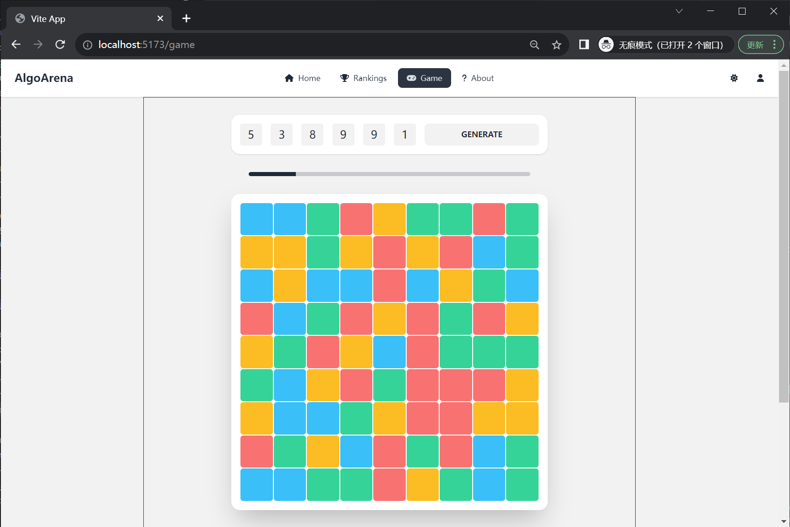

# COSC349 Cloud Computing Architecture

Project name: Algo Arena

## Get Started

```bash
git clone https://github.com/ruiyi666/COSC349.git
cd COSC349
vagrant up
```

Navigate to http://192.168.56.11:80/ or http://localhost:8080/

## Description

**Algo Arena** is a gaming platform designed specifically for enthusiasts who enjoy strategy and coding. The platform facilitates an interactive environment where players can:

1. Account Management - Register, log in, and manage profiles.
2. Game Rooms - After logging in, players can enter a room using a room number, allowing them to engage in gameplay with other members of the same room.
3. Future Prospects - In the pipeline is an exciting feature where users will have the ability to submit strategy codes. This will allow their in-game avatars or agents to move according to the predefined logic, making gameplay even more dynamic and strategy-driven.




---

**Algo Arena** operates on three core virtual machines, each serving a distinct role:

1. **`192.168.56.11` - Frontend Server**: This VM handles the user interface. Crafted with Vue.js, Tailwind CSS, and DaisyUI, it presents a responsive and intuitive gaming experience.
2. **`192.168.56.12` - Backend Server**: The heart of our application logic. Developed using Django, it's responsible for game mechanics, user interactions, and real-time data processing. The integration of Django's RESTful API and Channels ensures seamless real-time communication.
3. **`192.168.56.13` - Database Server**: The primary data repository for **Algo Arena**. All game replays, user profiles, and relevant data are stored here. It's compatible with both SQLite and MySQL, ensuring flexibility and security in data management.

## Usage

### Requirements

- **VirtualBox** 7.0.x: https://www.virtualbox.org/wiki/Download_Old_Builds_7_0

- **Vagrant** v2.3.7: https://www.vagrantup.com/

Certainly! Here's a continuation of your documentation:

---

### Run

After installing the necessary requirements:

**Clone the Repository**: 
   Use the command `git clone https://github.com/ruiyi666/COSC349.git` to clone the Algo Arena repository to your local machine.

**Navigate to the Project Directory**: 
   Change your current directory to the Algo Arena directory by using the command `cd COSC349`.

**Start the Virtual Machines**: 
```bash
vagrant up
```
   Use the above command to initiate and set up the virtual machines as per the configuration in the Vagrantfile. This command will set up the three core servers: frontend, backend, and database.

**Access the Web Interface**: 
   Once the setup completes, open your browser and navigate to `http://192.168.56.11:80/` or `http://localhost:8080/` to access the Algo Arena interface.

### Cleanup

To shut down the virtual machines and clean up any resources they've used, you can use:

```bash
vagrant destroy
```

This command stops all running virtual machines associated with the project and removes their files, reclaiming the disk space they used.

## Database Description

The **Algo Arena** uses a relational database model, leveraging Django's ORM capabilities to manage and store game-related data. Here's an overview:

### Strategy Model

Represents a game strategy, containing:

- **User**: Foreign key link to the user who created the strategy.
- **Name**: A name for the strategy.
- **Description**: A detailed description of the strategy.
- **Is Manual**: A boolean to determine if the strategy is manually controlled.
- **Timestamps**: Track when the strategy was created and last updated.

### Game Model

Represents an individual game instance, containing:

- **Timestamps**: Track when the game was started and last updated.
- **Metadata**: JSON field to store additional game-related data.

### Player Model

Represents a player in a game, containing:

- **Game**: Foreign key link to the game the player is participating in.
- **Strategy**: Foreign key link to the strategy employed by the player.
- **Score**: The player's score in the game.

### FrameAction Model

Stores actions performed by a player in a particular frame, containing:

- **Player**: Foreign key link to the player performing the action.
- **Frame**: The specific frame number during which the action occurred.
- **Action**: JSON field to detail the action taken.

### FrameState Model

Stores the state of a game at a particular frame, containing:

- **Game**: Foreign key link to the associated game.
- **Frame**: The specific frame number.
- **State**: JSON field detailing the game state at that frame.

## Backend API

The backend of **Algo Arena** is designed to provide a robust, scalable, and efficient service for all game-related operations. The API is divided into two primary sets, the RESTful API for standard web operations and the WebSockets API for real-time communication.

### RESTful API

Our RESTful API uses the Django Rest Framework to create, read, update, and delete (CRUD) operations on our main entities.

**Endpoints:**

1. **Users**
   - **List, Create**: `/users/`
   - **Retrieve, Update, Delete**: `/users/{user_id}/`

2. **Strategies**
   - **List, Create**: `/strategies/`
   - **Retrieve, Update, Delete**: `/strategies/{strategy_id}/`

3. **Games**
   - **List, Create**: `/games/`
   - **Retrieve, Update, Delete**: `/games/{game_id}/`

4. **Players**
   - **List, Create**: `/games/{game_id}/players/`
   - **Retrieve, Update, Delete**: `/games/{game_id}/players/{player_id}/`

5. **Frame Actions**
   - **List, Create**: `/games/{game_id}/actions/`
   - **Retrieve, Update, Delete**: `/games/{game_id}/actions/{action_id}/`

6. **Frame States**
   - **List, Create**: `/games/{game_id}/states/`
   - **Retrieve, Update, Delete**: `/games/{game_id}/states/{state_id}/`

### WebSocket API

For real-time communication, particularly during gameplay, **Algo Arena** leverages WebSockets.

**Endpoints:**

1. **Gameplay with Token Authentication**:
   - `/ws/play/{room_id}/{token}/`

2. **General Gameplay**:
   - `/ws/play/{room_id}/`

The `TokenAuthMiddleware` ensures that users can authenticate via tokens. If a token is provided in the query string, it fetches the corresponding user. This ensures that actions taken in the game are correctly associated with the authenticated user.

### Exploring the API

Once you have your local environment set up and running:

1. Navigate to [http://localhost:8000/](http://localhost:8000/).
2. Here you'll find the browsable API provided by Django Rest Framework.
3. You can explore various endpoints, see the data, and even test CRUD operations.

By using a combination of RESTful and WebSocket APIs, **Algo Arena** provides a seamless experience for players, ensuring both standard web operations and real-time game interactions are smooth and efficient.

## Frontend Page

Built with Vue.js, Tailwind CSS, and DaisyUI, the **Algo Arena** frontend offers the following features:

1. **Responsive Design:** Ensures optimal viewing across various devices.
2. **Main Routes:** 
   - **Home**: The platform's entry point.
   - **Rankings**: Displays player rankings.
   - **Game**: The core gameplay interface.
   - **About**: Information about the platform.
   - **404 Page**: Handles undefined routes.
3. **State Management:** Uses Vuex to manage user authentication and game state.
4. **Icon Integration:** Incorporates FontAwesome icons for a richer UI.
5. **Global Components:** A consistent header and footer across all views.
6. **Navigation Guard:** Middleware for route-specific logic.
7. **Lazy Loading:** Dynamic imports for efficient page loading.

## Future Plans

- **Programmatic Strategy** We aimed to integrate a feature where players can submit their own coded strategies. This would allow users to craft intelligent agents using programming logic, taking the gameplay to the next level. Players could challenge their own algorithms against others, fostering a competitive and learning environment.
  
- **Leaderboards**: Introducing a system to rank players based on game performance and strategy effectiveness.

