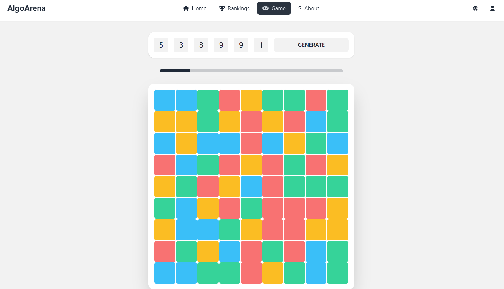

# Algo Arena

## Get Started

```bash
git clone https://github.com/ruiyi666/algo-arena.git
cd algo-arena
vagrant up
```

Navigate to 

- frontend: http://localhost:8080/ 
- backend: http://localhost:8000/

## Description

**Algo Arena** is a gaming platform designed specifically for enthusiasts who enjoy strategy and coding. The platform facilitates an interactive environment where players can:

1. Account Management - Register, log in, and manage profiles.
2. Game Rooms - After logging in, players can enter a room using a room number, allowing them to engage in gameplay with other members of the same room.
3. Future Prospects - In the pipeline is an exciting feature where users will have the ability to submit strategy codes. This will allow their in-game avatars or agents to move according to the predefined logic, making gameplay even more dynamic and strategy-driven.



---

**Algo Arena** operates on three core virtual machines, each serving a distinct role:

1. **`192.168.56.11` - Frontend Server**: This VM handles the user interface. Crafted with Vue.js, Tailwind CSS, and DaisyUI, it presents a responsive and intuitive gaming experience.
2. **`192.168.56.12` - Backend Server**: The heart of our application logic. Developed using Django, it's responsible for game mechanics, user interactions, and real-time data processing. The integration of Django's RESTful API and Channels ensures seamless real-time communication.
3. **`192.168.56.13` - Database Server**: The primary data repository for **Algo Arena**. All game replays, user profiles, and relevant data are stored here. It's compatible with both SQLite and MySQL, ensuring flexibility and security in data management.

## Usage

### Requirements

- **Vagrant** v2.3.7: https://www.vagrantup.com/

Choose one of the following virtualization providers:

- **VirtualBox** 7.0.x: https://www.virtualbox.org/wiki/Download_Old_Builds_7_0
- **Docker** v20.10.x: https://docs.docker.com/get-docker/

### Run

After installing the necessary requirements:

**Clone the Repository**:
Use the command `git clone https://github.com/ruiyi666/COSC349.git` to clone the Algo Arena repository to your local machine.

**Navigate to the Project Directory**:
Change your current directory to the Algo Arena directory by using the command `cd COSC349`.

**Start the Virtual Machines**:

```bash
vagrant up --provider virtualbox
# or
vagrant up --provider docker
```

Use the above command to initiate and set up the virtual machines as per the configuration in the Vagrantfile. This command will set up the three core servers: frontend, backend, and database.

**Access the Web Interface**:
Once the setup completes, open your browser and navigate to `http://192.168.56.11:80/` or `http://localhost:8080/` to access the Algo Arena interface.

### Cleanup

To shut down the virtual machines and clean up any resources they've used, you can use:

```bash
vagrant destroy
```

This command stops all running virtual machines associated with the project and removes their files, reclaiming the disk space they used.

## Deploy

Here are the steps to deploy the application on AWS.

### Requirements

- **Terraform** v1.5.7: https://developer.hashicorp.com/terraform/downloads
- **AWS CLI** v2: https://docs.aws.amazon.com/cli/latest/userguide/getting-started-install.html
- **(Optional) node.js** v18.17.0: https://nodejs.org/en/download/

### Run

**Configure** AWS CLI with your credentials. Access key ID and secret access key can be obtained from AWS IAM.

```bash
# Configure AWS CLI, 
# Edit ~/.aws/credentials
aws configure
```

**Authenticate**, remember to generate a new SSH key pair named `algo-arena.pem` and place it in the project directory.

**Initialize** Terraform for the project.

```bash
terraform init
```

Here we use EC2 as the deployment method.

```bash
terraform apply
```

If you want to deploy the application frontend to S3, you need to install node.js and run the following command.

```bash
terraform apply -var="frontend_deployment_method=s3"
```

### Cleanup

To destroy all resources created by Terraform, run:

```bash
terraform destroy
```

## Future Prospects

- **Game Replay**: Now, every action (or frame state) in the game is recorded in the database. And can be accessed via the backend API `/api/games/<game_id>/`. But the frontend does not support the replay of the game. In the future, we will add a replay feature to the frontend.
   - Next frame button
   - Previous frame button (a little bit difficult)
   - Play button
   - Pause button
   - Speed control
   - Progress bar (as done in the game play page)
   - Save replay (download as mp4)

Possible solutions:
   - Add a new view in `frontend/src/views/` to support the replay feature.
   - Refer to the components in `frontend/src/components/PlayGame.vue` and implement the `frontend/src/components/ReplayGame.vue` component.
   - Access the game replay data via the backend API `/api/games/<game_id>/`, `/api/games/<game_id>/frames`, `/api/games/<game_id>/actions`.

- **Player Profile**: The button in the top right corner of the page is a placeholder for the player profile page. In the future, we will add a player profile page to the frontend. 
   - Player state: online, offline, playing
   - Player information
   - Player avatar
   - Player ranking
   - Player game history
   - Player strategy list
Through the game history, players can access the replay of the game.

- **Strategy Execution**: The architecture of **Algo Arena** is designed to support the execution of strategy codes. And for current implementation, each users owns a default strategy, which means they operate the avatar according to their keyboard input. In the future, users will be able to submit strategy codes.

Possible solutions:
   - Support Python first, the code can be executed directly on the backend server. But we need to consider the security issue. Store the code in the database, and load the code when the game starts.
   - Support socket communication. Put the code in a docker container, and the container communicates with the backend server via socket. This can ensure the security of the backend server. Still, it can be easily extended to support other languages.

Possible backend Solution:
   - The game starts when the room is full.
   - Allow 3-4 players in a room.
   - The player who creates the room can choose the number of players, the room id, or the room id is generated automatically. Set the grid size, the game speed, and the maximum number of frames.
   - In the `backend/server/services.py` file, the `GameServer` represents a single game, hasing a `game_timer()` that sync all the operations to players. Maybe an easy way is to create a new `StrategyServer` class, which can accept the strategy code and executes like the `GameConsumer` class. And the `GameServer` class can create a new `StrategyServer` instance for each player.

Possible frontend Solution:
   - Add a new view in `frontend/src/views/` to support upload, delete, and list strategies.
   - Adjust the `PlayGame.vue`, take mannual operating as a strategy. Before the game starts, users can choose set the room id, set the number of players, choose a strategy for their avatar. For other users, they first enter the room id, and then choose one or more strategies for their avatar. The game starts when the room is full.
   

