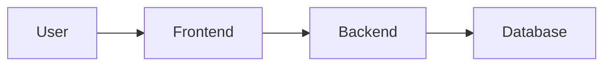

# COSC349 assignment 2 report

- Demo: http://algo-arena-frontend.s3-website-us-east-1.amazonaws.com

- Repo: https://github.com/ruiyi666/COSC349.git

## Introduction

In this assignment, I have deployed my project **Algo Arena** to AWS, which is a web application that requires a frontend, a backend server, and a database. You can use only one command to deploy the project to AWS, or locally (See **Deployment** for details).

```bash
terraform apply
# or
vagrant up
```

In this report, I will introduce the architecture of the project, the deployment process, and the cost of the project. 

## Architecture



The architecture of the project is simple, which is a three-tier architecture. The frontend server is responsible for the user interface, the backend server is responsible for the game mechanics, user interactions, and real-time data processing, and the database server is responsible for storing all game replays, user profiles, and relevant data.

### File Structure

```bash
.
├── LICENSE                 # License
├── README.md               # README
├── algo-arena.pem          # AWS key pair (not in the repo)
├── main.tf                 # Terraform configuration file
├── Vagrantfile             # Vagrant configuration file
├── docs/                   # Documents
├── backend/                # Django backend
├── database/               # SQLite / MySQL database
├── frontend/               # Vue.js frontend
└── scripts/                # Scripts for building VMs
```

### Backend

The backend is a Django project, supporting RESTful API and WebSockets API, a totally asynchronous backend. When developing the backend, run:
    
```bash
cd backend
python manage.py makemigrations
python manage.py migrate
python manage.py runserver
```

The backend server is running on port `8000` by default. And you can see `http://localhost:8000/docs` for the API documentation.

But when deploying the project, you need to run the backend server with `daphne` and `asgi`, which is a little bit different from the development environment.

```bash
cd backend
python manage.py makemigrations
python manage.py migrate
daphne backend.asgi:application
```

### Frontend

The frontend is a Vue.js project, which is a single-page application. When developing the frontend, run:

```bash
cd frontend
npm install
npm run dev
```

The frontend server is running on port `5173` by default. And you can see `http://localhost:5173/` for the frontend. Still, you need to run the backend server at the same time. And you can change the backend address in the `.env` file in the `frontend` directory.

Moreover, using the following command to build the frontend:

```bash
cd frontend
npm run build
```

The built files will be in the `frontend/dist` directory, upload them to any static website hosting service.

## Deployment

With the help of **Vagrant** and **Terraform**, this project can be deployed easily, either locally or on AWS.

### Local Deployment

This part is the same as the first assignment, but some bugs have been fixed. You can use one command to start the virtual machines and access the web interface at `http://localhost:8080/`.

- **VirtualBox**

    ```bash
    vagrant up --provider virtualbox
    # requires VirtualBox and ubuntu/focal64 box
    ```

- **Docker**

    ```bash
    vagrant up --provider docker
    # requires Docker and dme26/vagrant-provider:ubuntu-focal image
    ```

### AWS Deployment

Here we use **Terraform** to deploy the project to AWS. Still, we provide two ways to deploy the project. 

#### Prerequisites

Surely, it is necessary to install **Terraform** and **AWS CLI** on the local machine. 
For **AWS CLI**, you need to configure it with your AWS credentials. 

```bash
aws configure   # configure AWS CLI, ~/.aws/credentials
```

Still, generate a key pair for EC2 instances, named `algo-arena.pem`, and put it in the root directory of the project.

Initialize Terraform:

```bash
terraform init
```

If you want to deploy the frontend to S3 (See the section below), you need to install **Node.js** on the local machine.

#### Deploy

- **Deploy the frontend and backend to EC2, and the database to RDS**

    ```bash
    terraform apply
    // or
    terraform apply -var='frontend_deployment_method=ec2'
    ```

- **Deploy the frontend to S3, and the backend to EC2, and the database to RDS**

    ```bash
    terraform apply -var='frontend_deployment_method=s3'
    ```

> Note that the default name of the S3 bucket is `algo-arena-frontend`, which might be occupied. So you can change it with the variable `frontend_bucket`.
> ```bash
> terraform apply -var='frontend_bucket=your_bucket_name'
> ```
> Remember to access the frontend at:     
> `http://{your_bucket_name}.s3-website-{region}.amazonaws.com`.


#### Illustration

The reason why we provide two ways to deploy the project is that in the first way, we only need to install **Terraform** and **AWS CLI** on the local machine, and all the resources will be created on AWS and built automatically. However, we don't have another non-EC2 resource as the requirement of the assignment, and the frontend of the project is a static single-page application, which is not need to be deployed on Apache or Nginx on EC2.

So in the second way, we deploy the frontend to S3, and the backend to EC2, and the database to RDS. In this way, we can meet the requirements of the assignment, but the drawback is that we need to build the frontend locally and upload it to S3, during which we need to install **Node.js** on the local machine. 

Details of the second way:
- Create an RDS instance for the database
    - MySQL 8.0
    - db.t2.micro instance
    - 20GB storage
    
    An address is generated for the database, where all the users' info, game records are stored. The address will be used in the `.env` file in the `backend` directory.

- Create an EC2 instance for the backend
    - Ubuntu 20.04
    - t2.micro instance
    - Daphne + Django 4
    
    The provision script will transfer the source code to the EC2 instance and prepare the environment, which means creating a `.env` file in the `backend` directory, containing the database address and credentials. 
    
    The initial database migration will be executed automatically. 
    ```bash
    python manage.py loaddata database/data.json
    ```
    The above command that is automatically executed loads the `database/data.json` file into the database. You can export the database to a json file using the following command:
    
    ```bash
    python manage.py dumpdata > database/data.json
    ```

    Finally, run the backend server.

- Create an S3 bucket for the frontend
    - Static website hosting
    
    The provision script will build the frontend locally and upload it to the S3 bucket. Still, it will create a `.env` file in the `frontend` directory, containing the backend address. And this address is hard-coded in the frontend build dist files. So these files can be uploaded to any static website hosting service, such as S3, even github pages (using Github Actions for free).

> Note:
>
> I have tried to deploy the frontend to `aws-amplify-app` or `aws-apprunner`, but I failed. The reason is that those services are quite convenient, but they need to pull the source code from Github, this is not elegant because when I change the source code, I need to push it to Github, and then the service will pull the source code and build it. So I choose to build the frontend locally and upload it to S3.
> But this is not a good solution, because what if I don't have node.js on my local machine? I think in the future I will try to use `CodeBuild` to build the frontend and upload it to S3.

## Cost

I use the [AWS calculator](https://calculator.aws/) to calculate the cost of the project. The cost is based on the US East (N. Virginia) region.

### Running Cost

- **RDS**: 
    - 0.017 USD per Hour * 24 Hours * 30 Days 
    - 0.115 USD per GB-month * 20 GB * 30 Days
    - Total: 14.71 USD per Month

- **EC2**: 
    - 0.0117 USD per Hour * 24 Hours * 30 Days 
    - 0.08 USD per GB-month * 20 GB * 30 Days
    - Total: 10.07 USD per Month

- **S3**: 
    - 1 GB storage for the static website
    - 100000 PUT, COPY, POST, LIST
    - 100000 GET, SELECT
    - 10 GB Select Data Returned
    - 100 GB Select Data Scanned
    - 10 GB Data Transfer to Internet
    Total: 1.67 USD per Month

- **Total**: 26.45 USD per Month

Some Costs that may be ignored:
- the backend server hosted on EC2 serves a restful API, and a websocket API. These APIs are used to communicate with the frontend between users. Which requires a lot of data transfer. However, the data transfer (requires Elastic IP) is a little bit complicated to calculate, so I ignore it here, and the cost will not exceed 7.3 USD per Month.

### Shutdown Cost

To avoid the running cost, we can shutdown all the unnecessary resources and only keep the database server running. 

```bash
terraform apply -var='database_only=true'
```

The database server is running on RDS, which is a managed service, using a `db.t2.micro` instance, allocated 20GB storage. The cost is:

- 0.017 USD per Hour * 24 Hours * 30 Days + 0.115 USD per GB-month * 20 GB * 30 Days = 14.71 USD per Month

> Issue: The database server is still running on EC2, which is not necessary. If we stop the database server, the cost will decrease to 2.3 USD per Month since the storage is still allocated.
> However, I haven't tried it so this situation is only a hypothesis.

### Destroy Cost

No cost here. Execute the following command to destroy all the resources, and go to the AWS to check if there is any resource left.

```bash
terraform destroy
```

